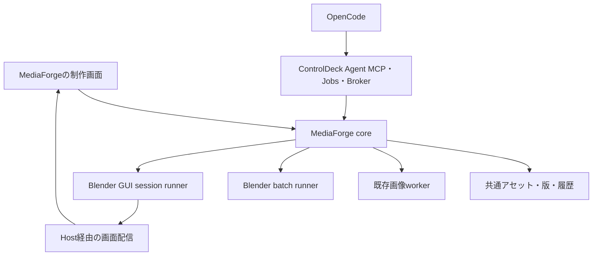

# MediaForge 統合3D Studio — 設計ゴール

Status: 承認された製品方針 / 実装前の詳細設計  
Date: 2026-09-05  
実装・設計・配布: **ControlDeckMediaForgeのみ**

## 1. 決定と文書の優先順位

利用者は画像と3Dを統合する方針を選択した。3D StudioはMediaForgeの機能として実装する。
独立SceneForgeアドオン、リポジトリ、DB、APIサービス、署名鍵、配布系統は作らない。
SceneForgeという製品名の採用も必須ではなく、画面の既定表記は「3D / 3D Studio」とする。

設計の正は引き続き `base-plan.md`、Host境界は `controldeck-integration-plan.md`、
画面の正は `design-workspace-ux.md`。本書と関連設計はその3D拡張を具体化する。
既存G8の `asset.pack + profile=3d.project.glb`、G1凍結契約、既存画像機能を変更しない。
本書の新しいAPI名・状態・既定値は実装目標であり、現在利用可能なAPIではない。

詳細:

- [Blender導入管理・Web操作](design-blender-runtime-and-web.md)
- [アセット・テクスチャ・OpenCode連携](design-3d-assets-and-opencode.md)
- [開発・管理・リリース規約](development-release-3d-studio.md)
- [実装順序と受入条件](implementation/g8-3d-studio-plan.md)
- [調査した参照リポジトリと現状差分](reference-3d-studio.md)

## 2. 利用者に届けるゴール

| ID | 利用者ができること | 完成を確認する操作 |
|---|---|---|
| GOAL-01 | 画像と3Dを同じ素材ライブラリで管理 | 画像・GLB・Blender制作ファイルを絞り込み、親子関係から相互に移動 |
| GOAL-02 | ブラウザだけで3Dを確認 | GLBの回転・拡大・材質・ワイヤー・アニメーションを確認 |
| GOAL-03 | 設定からBlenderを管理 | 導入、更新、切替、修復、削除、失敗後の再開を画面で完結 |
| GOAL-04 | サーバーのBlender GUIを操作 | 専用セッションで編集・保存し、切断後に再接続 |
| GOAL-05 | OpenCodeへ自然言語で制作を依頼 | 形状作成、テクスチャ生成、適用、検証、書き出しまでJobで追跡 |
| GOAL-06 | MediaForge画像をモデルに貼る | 既存画像を材質スロットへ割当て、新旧を比較・採用 |
| GOAL-07 | 制作をやり直せる | 元ファイルを保持し、版を比較・復元、失敗した工程だけ再実行 |
| GOAL-08 | ゲームやアプリへ素材を渡す | grant経由でGLB・画像・manifestを配置しreceiptを確認 |
| GOAL-09 | 重い処理を止められる | 待機取消、実行取消、Webセッション終了でプロセス・予約を回収 |
| GOAL-10 | 画像・音声・LLMと共存 | 共通Broker経由で競合を解決し、別サービスを勝手に停止しない |

代表フロー: 「剣を作って」→形状案→3Dプレビュー→「この画像を刃に貼って」→
画像編集または生成→UV/材質へ割当て→Web Blenderで調整→新しい版を保存→プロジェクトへ配置。

## 3. 統合する範囲と分離する範囲

| 項目 | 方針 |
|---|---|
| UI・ナビ・設定 | MediaForgeの作る / ライブラリ / 状況 / 設定へ統合 |
| アセット・検索・履歴 | 既存asset/provenance/Jobsを拡張。3D専用の第二ライブラリを作らない |
| Add-on ID / route / port | `media-forge`、`/x/media-forge/workspace`、既存サービス設定を維持 |
| OpenCode | 既存 `controldeck_addons` Agent MCP経由。専用OpenCodeを同梱しない |
| 画像生成 | 既存MediaForgeの画像job・runtime・capability routingを利用 |
| Blender | バージョン別の独立runtime。coreへbpy/torchをimportしない |
| 画面配信 | 専用session runnerと画面配信pack。個人デスクトップを共有しない |
| SonicForge | 管理・リリース・日英UI・実機受入の参照。コード・環境は統合しない |
| ControlDeck | 共通Hostのみ。Blender固有ルート・依存・UIを追加しない |

矢印は責務・制御経路を示す。Pythonモジュールの直接依存を意味しない。

## 4. 段階的な範囲

### 初期提供に含める

- 既存G8 GLB加工の維持、GLBビューワー、共通Library。
- Blender基本環境とWeb操作環境の設定管理。
- 専用のサーバー側Blender GUI、保存・復旧・再接続。
- 型付きの形状作成・編集、MediaForge画像の材質割当て。
- OpenCodeから同じ制作機能を呼び出す経路。
- `.blend`制作版と配布用GLBの区別、immutable revision、検証済みexport。

### 後続・条件付き

- 任意の生成Pythonを実行するExpertモード: OS隔離・権限・終了制御の受入後。
- image-to-3D / text-to-3Dモデル: 既存G9の実験的導入ゲートで個別評価。
- GPU画面配信、WebRTC、複数同時編集、USD/FBXなど: 対応ごとの実測後。
- 音声を付けた動画制作: 必要時にSonicForgeの公開契約を利用する別計画。

Web Blenderの実現を生成3Dモデルの採用待ちにしない。OpenCodeによる型付き制作は
Blenderの操作で成立させる。生成画像が自動的に正しいUVやPBR材質になるとは扱わない。

## 5. 画面仕様

既存workspace内の「作る」で画像 / 動画 / 3Dを切替える。LibraryとActivityは共通。
既存画像UIを3D向けに作り直さない。対象3Dを開いたときに必要な操作を段階表示する。

| 面 | 主操作 | 詳細で扱う内容 |
|---|---|---|
| 3D制作 | 指示、取り込み、作成 | 寸法・ポリゴン予算・原点・品質プリセット |
| 3D詳細 | 回転表示、材質変更、Blenderで編集 | UV、法線、LOD、collision、検証報告 |
| 材質 | Libraryから画像を選ぶ / 新しく作る | チャンネル、色空間、UV set、wrap、normal convention |
| Web Blender | 接続、保存、終了 | 画質、入力、バージョン、復旧ファイル、診断 |
| Library | 検索、種類、タグ、コレクション | 依存画像、版、容量、ライセンス、provenance |
| Activity | 進捗、取消、再試行 | 工程、待機理由、ログ、実測値 |
| 設定 | Blender環境をセットアップ | 版管理、画面配信pack、CPU/GPU、保存、保持期間 |

設定入口は「設定 / Settings」、内側は「画像・動画モデル」「Blender」「保存・診断」とする。
現在の「モデル管理」から設定入口の名称を変えるときは、その文言変更も同じUI PRに含める。
導入・更新・削除はSimpleで到達可能。hash・fingerprint等だけをAdvancedへ置く。
日英、dark/light、theme/locale/safe-area変更、Hostの戻る/進む・route同期に対応する。
opaque iframeでCookie/localStorage/sessionStorageを前提にせず、既存preferencesを使う。

モバイル320pxではLibrary、軽量ビューワー、制作依頼、状況、保存・停止、設定管理を提供。
BlenderフルGUIはPC・キーボード・マウス推奨と明示し、全画面・入力補助で利用可能にする。
モバイル対応を理由に既存 `mobile=embedded` をcompanionへ退行させない。

## 6. 可用性と品質

coreのhealth、batch加工、GUI編集、GPUレンダリング、生成3Dモデルを別々に診断する。
Blender未導入でも画像生成・Library・設定は動作し、3Dには導入導線を示す。
GUIが使えなくても既存CPU加工を無効にしない。ソフトウェア描画をGPU対応実績と混同しない。

初期の製品目標（実測前）:

- 通常のdurable job受付を2秒以内に返す。時間の長い処理は受付API内で待たない。
- 小規模GLBのビューワー初回表示をLANで3秒以内、warm再表示を1秒以内の目標とする。
- Web操作はLAN・1280x720で15fps以上、入力反映p95 200ms以下を評価目標とする。
- 50件のLibrary表示にフルGLB/.blendを一括取得しない。
- 実機の起動時間、RAM/VRAM、CPU、転送量、保存時間、入力遅延を記録する。

これらは性能保証ではない。機器・scene・描画backend・配信方式を添えて測り、未達なら
品質プリセットや提供範囲を見直す。既存画像生成への影響を同じ環境で比較する。

## 7. 保存・終了の約束

ブラウザを閉じても制作jobは継続する。GUIは切断猶予とidle timeoutを持ち、無期限に放置しない。
保存とは制作版の確定、GLB公開とは別の検証工程。未検証の結果を「完成」と表示しない。
Blender削除は実行環境だけを対象とし、画像・モデル・制作ファイル・履歴を残す。
データの完全削除は影響範囲と参照を示した別操作にする。

## 8. 完了条件

上記GOAL-01〜10と実装計画の必須受入を対象Ubuntu上で確認し、既存画像・G8・OpenCodeの回帰がない。
設計だけ、fake workerだけ、unit testだけで完成と記録しない。
実測は `implementation-status.md` に残し、今回の文書追加時点はすべての新機能をNOT IMPLEMENTEDとする。
