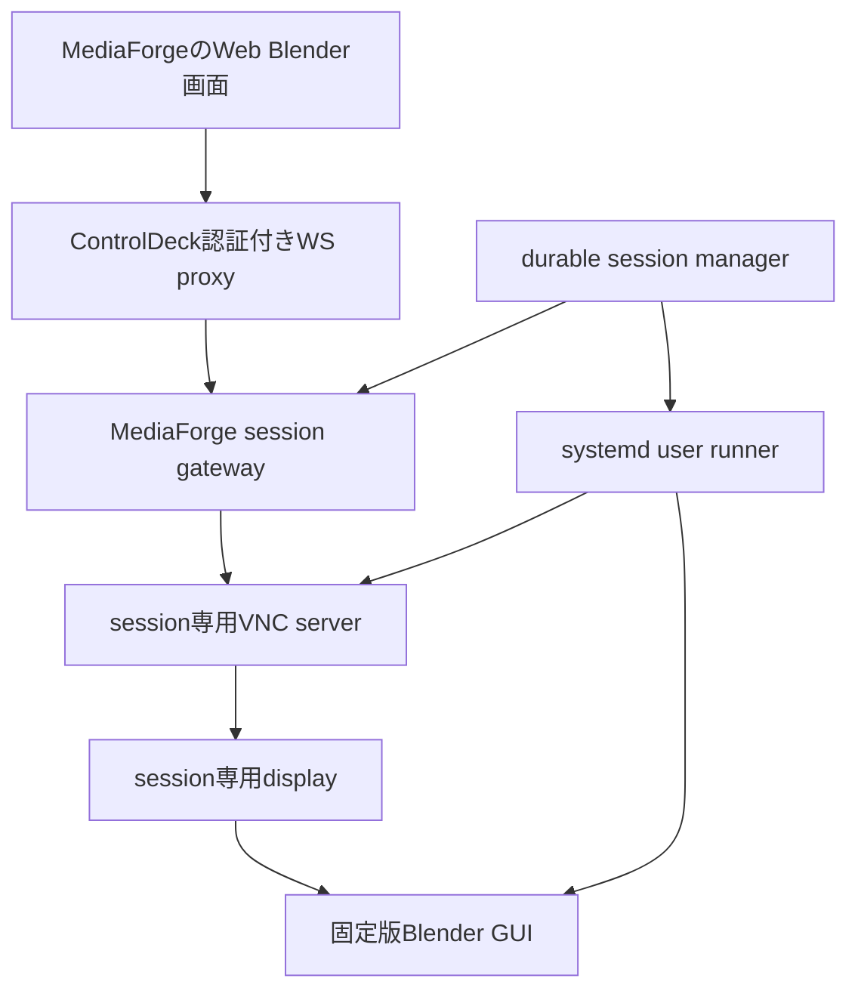

# Blender環境管理とサーバーGUIのブラウザ操作

Status: 3DS-2 runtime lifecycle・3DS-5a Web pack・3DS-5b GUI runner実装済み / RFB gateway未実装
Date: 2026-09-06
上位設計: [統合3D Studio](design-3d-studio.md)

## 1. Web Blenderの定義

サーバーに導入したBlenderの通常GUIを専用セッションで実行し、その画面と入力をブラウザへ接続する。
ブラウザ内でBlenderをWASM実行する構成ではない。GLBビューワーとは別機能である。

初期候補は **noVNC + WebSocket/VNC relay + 専用仮想display + Blender**。
noVNCがVNCをWebSocketで扱う点は[公式説明](https://novnc.com/)を参照。
実装前にnoVNCの固定revision、VNC server、display方式、配布条件を互換性表へ記録する。
RFBのbinary streamを既存workspace JSON `/ws`へ混ぜず、専用session pathをHost proxyで中継する。

## 2. 管理対象と所有権

| 管理対象 | 管理者 | 設定からの操作 |
|---|---|---|
| MediaForge軽量bundle | ControlDeck Feature lifecycle | 導入・更新・rollback・削除 |
| Blender基本環境 | MediaForge runtime manager | 導入・検証・更新・切替・修復・削除 |
| Web操作pack | MediaForge runtime manager | 導入・診断・更新・削除 |
| GPU driver / kernel / system package | OS管理者 | 不足診断と手順提示。暗黙のsudoや更新をしない |
| 外部登録Blender | 外部管理者 | 診断・登録解除。実体の更新・削除をしない |
| 制作物・画像・履歴 | 利用者 | Library経由の版管理・書き出し・ごみ箱 |

ManagedとExternalを実体・DBの両方で区別する。画面入力から任意URL、実行ファイル、shell commandを
受け取らない。External登録は権限付きのサーバー設定経路で検証し、通常画面にはopaque runtime IDを返す。
OSで導入したBlenderや他アドオンのruntimeを、勝手にScene用として管理下へ移さない。

既存の固定4.5.9 legacy参照についても「実体削除」と「登録解除」を分ける。
解除はregistryから参照を外し、同じatomic registry更新に自動登録抑止を記録する。
status/startupによる再検出では復活させず、明示的な再登録だけで抑止を解除する。
再登録は現在の設定先とstamp/manifestを再検証し、不正なら抑止を保持する。
実行参照・active・project pinの既定の保護はmanagedと同様に維持する。
§4.1の履歴参照確認付き実体削除はmanagedだけに適用し、外部登録解除の権限を拡大しない。
resolverはlive/activeを保護し、設定orchestratorがproject pinと確認fingerprintを保護する。
これはサーバー設定で指定済みの固定legacy実体の操作であり、ブラウザから任意pathを受けない。
registryの加法的private field `legacy_registration_disabled` は省略時false。
旧coreは未知fieldをfail-closedで拒否するため、解除後に旧coreへrollbackする場合は
runtime registryの事前snapshotも復元する。外部Blender実体にはmigrationを行わない。

## 3. runtime配置と既存G8の移行

提案する永続配置（既存Host Featureのdata/cache環境変数を優先）:

| 場所 | 内容 |
|---|---|
| MediaForge data / runtimes / blender / version-platform-arch | immutableなBlender展開先 |
| data / runtime-state | 所有権、catalog、fingerprint、active版、参照、operation journal |
| data / scenes | 制作working copy、autosave、recovery |
| data / assets | 既存immutable asset store。3Dも同じstore |
| data / sessions | session ID、runner識別子、display、lock、期限。秘密値は別保護領域 |
| cache / downloads | 検証前partialと再取得可能cache |
| source / worker_packs / blender | trusted処理スクリプトとpack metadata |

既存実装は `runtimes/blender-4.5.9` と `config/blender-runtime.json` を使う。
`blender_compile.py`にも固定配置参照があるため、UIだけ作って複数版を選べると主張しない。
最初にruntime resolverを追加し、G8の固定互換profileが要求する版を解決できるようにする。

移行手順:

1. 現行runtime stamp、実行version、hash、所有権を読み取り専用で調査。
2. 正常な既存runtimeをlegacy参照として登録。初回から削除・移動・再downloadしない。
3. persistent rootへ移す場合は別の明示operationでstaging copy、検証、参照切替を行う。
4. legacy移行元の旧場所は参照とrollback依存がゼロになるまで保持。
   移行後のmanaged版に対する利用者の明示削除は§4.1に従う。
5. 既存 `./mf.sh blender build/status` とG8既定profileの互換テストを維持。

新しいBlender版をactiveにしても既存G8 profileのcompiler契約を無条件で変更しない。
制作sessionは起動時にruntime IDとversionを固定し、実行中の参照を差し替えない。

## 4. 設定の操作仕様

| 操作 | 動作 | 失敗・競合時 |
|---|---|---|
| 導入 | trusted catalogからexact versionを選び容量確認、download、hash、展開、probe | partial/journalを保持して再開。現在版は維持 |
| 更新確認 | catalogとの差分を表示。自動適用しない | offlineでも導入済み環境が使える |
| 更新 | 新版を隣にstageしprobe後、次回起動の既定に切替 | 稼働job/sessionは旧版のまま |
| 切替 | 検証済み版を既定へ。project pinを尊重 | 不適合版は理由を表示 |
| 修復 | 破損の検証後、同じ版を別stagingで再構築 | 元の制作物は変更しない |
| 削除 | managed runtimeの参照と容量を表示し確認後に対象だけ削除 | 稼働参照ありは拒否。停止後に再試行 |
| cache整理 | 再取得可能cacheだけを整理 | runtime/asset/recoveryを含めない |

初期セットアップは「Blender基本環境」と「ブラウザ操作環境」を別packにする。
「Web Blenderを使う」で両者の必要分を一度に計画できる。画像モデルの全導入を要求しない。
重いBlender downloadを通常のMediaForge起動やbundle更新で暗黙実行しない。
UIと `mf.sh` のCLIサブコマンドは同じorchestratorを呼ぶ。doctor/statusは読み取り専用。
修復の候補公開も削除と同じruntime受付guardで排他にし、候補probe後・rename前に
in-process参照とdurable Job/GUI/working copy参照を再検査する。稼働参照があれば
`blender_runtime_in_use`で失敗し、元の実行環境を差し替えない。履歴pinやactive指定だけで
停止済み版の修復を禁止しない。guard取得・DB照合・rename/registry/rollback/cleanupは
worker thread内で行い、開始済み公開threadはshutdown取消でも終端まで追跡する。
修復のregister_managedはプロセス間registry lockで待つことがあるため、登録から戻った後も
旧directoryを破棄する前に永続cancel flagを再検査する。この待機中のHost取消・認証喪失では
候補を回収して旧directoryを戻し、canceled/failedと終端outboxを一致させる。
単なるローカルtask停止による開始済みthreadのdrainと、永続flagによる取消は区別する。
新規install/updateと、配置済みdirectoryの回復登録では、プロセス間registry lockを取得した後、
registryを書き換える前に永続cancel flagを検査する。待機中の取消では登録とactiveを変更せず、
今回新規配置したcandidateだけを回収する。回復対象の既存directoryは削除しない。
updateの登録とactive変更は同じregistry書込みにまとめ、登録後の別activate待機をなくす。
最終取消検査からregistry fsync/DB終端までの全競合をこれだけで解決したとは扱わず、
commit境界と再起動整合性の受入を別途追跡する。
Host制御エラーの診断はallowlistのcode/HTTP statusとtask取消を区別し、remote messageやtokenを記録しない。
`blender install/update/switch/repair/remove` CLIは稼働中MediaForgeの同じorchestratorを呼び、
READMEへ正式掲載する。source runtime互換用の既存`blender build/status`は変更しない。

### 4.1 停止済み版の削除と履歴の保持（実装目標）

scenario Dは停止後に旧版Aだけを削除し、画像・scene・.blend・履歴の保持を要求する。
0.28.34のproject_referenceは全scene_revisionsを数えるため、単にGUIを止めるだけでは
永続的に削除できない。履歴削除や別版へのpin書換えでこの受入を通してはならない。

- 既定のremoveはproject参照があれば拒否する。既存クライアントの保護を維持する。
- 稼働・待機参照がゼロ、inactive、managed、正確な版の再導入が可能な場合だけ、
  「制作ファイルと履歴は残ります。再編集にはBlender X.Y.Zの再導入が必要です」の
  追加確認を出す。チェックは既定offで、確認なしの送信をbackendでも拒否する。
- private remove入力に任意boolの履歴参照確認を追加する。既定false、bool以外は拒否。
  previewのfingerprintに参照状態・確認対象版・再導入可能性を束縛し、実行直前にも再検査する。
  durable operationに確認内容を保持し、restart時に確認なしの別削除へ読み替えない。
- active版、未終端Job、GUIのqueued/preparing/starting/ready/saving/stopping、
  active working copy、in-process処理の参照は追加確認でも解除できない。
  GUIのruntime_idが未確定な準備中も対象scene/recoveryのpinから保護する。
- Job受付とruntime削除の競合も保護する。Host child作成を待っている間にpinを失わず、
  受付後から終端・process回収まで参照を持つ。終了フラグだけで実processの参照を外さない。
- runtimeのみを既存staging/remove機構で削除する。scene/revision/dependency/asset/provenanceや
  recipeの保存済みruntime_idを変更しない。別のactive版を自動適用しない。
- Libraryの画像・GLB表示、履歴閲覧、制作ファイルbackupは残す。編集・復元などBlenderが
  必要な操作は正しい版の再導入を案内し、不在をavailableと表示しない。
- 設定からtrusted catalogの同一版・同一archive identityを明示再導入できることを確認する。
  現在の推奨版への更新で代用しない。再導入経路がない版は確認付き削除を提供しない。

実装順: durable参照集計と受付/削除の排他 → 同期DB/filesystem処理のworker-thread化 →
追加確認付きoperation/再開 → 日英UIと正確な版の再導入導線 → 同一scene実機削除/再導入。
DB/ORM/同期subprocess待機をasync requestに追加しない。threadの開始済みatomic操作は
接続切断で放棄せず終端まで追跡する。参照lockをevent loop上で保持したまま別threadの
同lock取得を待つ構成を作らない。

設計選択の根拠: 履歴参照を永久拒否する案はscenario Dを満たさず、履歴削除はGOAL-07を壊す。
別版への自動pin変更は再現性とimmutable revisionを壊す。明示確認と同版再導入で双方を維持する。
現時点ではこの確認付き削除は未実装。0.28.34の拒否動作をこの機能の受入とは扱わない。

受付保護の先行実装: SceneWorkspace.acquire_recipe_runtimeがworker thread内で
版選択と参照取得を削除guardと排他に行う。SceneRecipeJobManagerがHost child受付待ち、
実行slot待ち、処理と取消cleanupの終端まで同じin-process参照を所有する。
stopは受付taskも回収し、wait_cleanupは参照解放まで待つ。
durable集計の先行実装はStore.active_scene_runtime_referencesで、未終端recipe Job、
active working copy、稼働GUIを同じDB snapshotから読む。GUIのruntime未確定時は
working/recoveryのpin、未指定ならscene current revisionを参照し、不明なら全版の削除を拒否する。
既存live_reference_countはin-processとdurable参照の合計、内訳をprivate previewへ追加する。
期限超過だけではworking copyの参照を外さず、正式なretireを待つ。
managed削除のpreview/受付/実行はworker threadでDB/filesystem処理を行い、開始済みthreadを
request取消で放棄しない。
GUI受付も同じresolver guard内でruntime ID/versionを確定しqueued recordへ保存する。
通常/復旧working-copy作成は版検査からcopy/DB lease確定まで同guardで排他にする。
全production callerはworker threadの取得をawaitし、取消なら新規copy/leaseを回収する。
GUI停止/中断は前の準備taskのcleanupを待つ。queuedのpinと異なる版へ準備中に変わった場合は
fail-closedにする。削除済み版への新規GUI受付は事前に拒否する。
確認付き削除と、その実削除commitを伴う同時開始/再導入の受入は引き続き残件である。

## 5. durable setup operation

### 公開commit境界の補完（2026-09-10設計、未実装）

実source/Blender/Hostで、登録完了後・DB終端保存前の取消によりlocal ready/cancel=trueと
Host canceledが残ることを再現した。PR469はregistry待機中の取消を保護するが、この区間は保護しない。
取消意図と実際のcommit結果を区別せず、チェックを1個ずつ後ろへ足すだけでは競合窓が移動する。

- 既存operation journalにprivateな公開phaseと必要なidentityを加法的に保存する。
  第二のJobs基盤は作らない。受付済み・公開中・公開完了と、遅延したstop意図を区別する。
  bearer、生の利用者path、任意の外部URLを保存しない。
- registry lock取得後、公開開始とcancel/認証喪失flagの照合を同じDB transactionで行う。
  先にstopが確定していれば公開を始めず回収する。公開開始が先なら、後続stopは遅延意図として残し、
  既に進むcommitを別taskが中断・削除しない。registry待機中にStore全体のmutexを保持しない。
- 公開中journalには対象runtime/archive identity、対象操作、以前のactive/登録identity、
  新規候補か回復対象か、repairの退避identityを束縛する。別operationの実体へ適用しない。
- 正常時は実公開結果とlocal終端/outboxを確定し、遅延取消・認証喪失を結果の補足として明示する。
  readyを失敗理由と混在させたり、取消前に止まったかのように装ったりしない。
  Hostが既にcanceledなら上書きせず、receipt不一致を保存・表示する。
- 公開開始後のI/O失敗、core再起動、registry/DB応答喪失ではjournalと実体を照合する。
  完了identityが証明できればその結果を回収し、未公開なら旧状態へ戻す。不明なら成功とせず、
  候補/以前の実体を保護して明示的な回復状態にする。参照を得た公開済みruntimeを無条件で削除しない。
- install/update/recovered/repairに同じ境界を適用する。公開開始前・開始後・registry後・終端前の
  cancel/revocation/shutdown、書込失敗、再起動を分けて試験する。phase移行と停止記録はworker側で実行する。
  既存のHost所有でないCLI経路にも互換性を持たせ、旧operationの再開policyを暗黙変更しない。

実装順は加法的journal/互換試験→停止受付と公開開始の競合試験→manager接続→実機取消/回復→
署名配布。現行の単一callback、in-process lockだけ、単体試験だけをdurable commitの証明にしない。

先行実装: 既存blender_runtime_operationsのprivate publication_jsonにschema_version=1、
committing/committed/recovery_required、bounded identity、開始/完了時刻、遅延stop理由を保存する。
Store.begin_blender_publicationはBEGIN IMMEDIATE内で既存cancel/所有operationのidentity/phaseを照合。
同じphaseの同一identityだけ再送可能。cancel/Host abortも同じDB書込競合へ入り、公開開始後なら
公開停止flagではなくstop_requestsへ理由を重複なしで記録する。
complete_blender_publicationは実検証済みcaller専用で、ready/公開完了/結果/Host outboxを同時確定する。
同じ結果の再送だけ冪等に扱い、別identity/結果で上書きしない。元operationの公開field集合は変えず、
遅延停止は結果のpublication_stop_requestsに補足する。private identityは公開応答に含めない。
再起動で未完了のjournalはfailed/blender_publication_recovery_requiredとして保護し、
未検証Host終端を作らず、同runtimeへの重複operationと通常の成功確定を拒否する。
旧publication_json=NULLの操作は従来policyを維持する。旧coreは新journalを解釈しないため、
この経路を有効化した後のdowngradeは未確定公開を解決するか更新前DB snapshotを復元してから行う。
このsliceではmanagerはまだbegin/completeを呼ばない。実体照合による回復API、managerのI/O失敗/drain、
UIでの遅延stop表示、署名installed受入を接続するまで公開競合の修正完了とはしない。

回復adapterの先行実装: BlenderPublicationRecoveryはowned worker threadから明示実行する。
参照guardとregistry flockを保持し、install/updateの登録全fieldと想定active、catalog/stamp、
実行ファイルSHA、実Blender preflightの前後一致を確認した場合だけ専用Store recovery確定へ進む。
この経路もready/公開完了/Host outboxを同時確定し、通常完了APIではrecovery_requiredを解除しない。
不一致・欠落・probe失敗は理由付きrecovery_requiredのまま保持し、実体・registryを変更/削除しない。
同一版repairは旧/新実行ファイルSHAが同じになり得るため、generationの追加証明なしに成功としない。
その識別情報と未公開candidateのrollback、managerからの自動接続は未実装であり、実体検証adapterだけを
全公開・修復・crash回復の完成と扱わない。先行実機試験は独立したprepare/recovery processを使うが、
prepareは意図的な正常exitで、OS強制kill/電源断の受入ではない。

同一版修復の世代識別（先行実装）: private identityへoptional generation/previous_generationを追加。
古いjournalで省略されていれば従来どおり未証明として扱う。新しい修復のgenerationは以前と同じ値を拒否。
create_generationはmanaged rootの`.staging/blenderop_<32hex>/candidate`にだけ、ランダム32hexと改行の
33-byte `.publication-generation`をexclusive/0600で作り、fileとdirectoryをfsyncする。
既存markerを上書きせず、公開済みrootへの新規作成も拒否する。候補と一緒にrenameされることで世代が残る。
readはNOFOLLOW/NONBLOCK、regular file/33-byte/形式/containmentを検証する。
回復は記録された世代をprobe前後で照合し、同一版repairも新候補との一致を証明できた場合だけ確定する。
markerなしの旧実体への復帰、別世代、probe中変更は保護状態のままにする。
このmarkerは暗号的な第三者認証ではなく、trusted managerの候補とjournalを対応付ける内部識別子。
archive/実行file hash/catalog/probe検査を置き換えず、managerはまだ新helperを呼ばない。
manager接続時はregistry lock取得と開始判定を**最初の実体renameより前**へ置く必要がある。
現行register_managed callbackはrename後なので、その場所へbeginを足すだけでは不十分。

Host所有setupの永続化は既存blender_runtime_operationsへ加法的に置く。
受付時のownerと一意なHost child ID、終端通知のoutbox/照合receiptだけをprivateに保存し、
bearerは保存・公開しない。所有者なしの既存ローカル操作を後からHost所有として採用しない。
DB初期化・再起動照合はworker threadで実行し、起動取消が重複しても移行transactionを放棄しない。
再起動で正規identityを失ったHost所有操作はfailed/host_context_lost（取消済みならcanceled）にし、
partialや旧runtimeを残す。未送信の終端意図を保持し、正規ownerの再認証後に照合する。
ローカル操作の従来の再開は維持する。DB基盤だけをrefresh/Host終端同期の実機受入と扱わない。
旧coreはこの所有権を理解しないため、Host所有操作導入後のdowngradeでは未終端操作を
新coreで停止・照合してから戻すか、書込停止下で更新前DB snapshotを復元する。

Host workspaceのinstall/Web install/update/repair/switch/exact install/removeは、既存managerの
共通受付に認証済みidentityを渡す。worker側でownerを予約し、detached childのowner/kind/IDと
短命credentialを検証・束縛してから既存runnerを起動する。返答前の接続取消でも受付を放棄しない。
重複要求は同ownerの実行中operationへ戻し、他ownerやローカル経路による後付け採用/取消を拒否する。
standalone HTTP/CLIのローカル操作には不要なHost childを追加しない。

CPU実行slot待ちから終端まで5秒周期でHost controlを確認し、期限前120秒でcredentialを更新する。
Host controlの読み取り専用GETでRemoteProtocolError/ReadErrorを受けた場合は、有効期限内の同じidentityで
1回だけ再照会する。再失敗・認証拒否・timeout・不正応答は従来どおり停止へ進む。
この再照会はJob作成・進捗更新・credential refresh・終端通知には適用しない。
phaseと単調な処理byte数をHost Jobへ報告する。期限切れ・不正refresh・Host終端では安全に停止し、
既存cancel検査点とowned workerのdrain後にlocal終端/outboxを確定する。ブラウザ切断は取消にしない。
shutdownも開始済み受付、worker、照合taskを回収する。tokenは実行task内だけに保持する。
Host child作成の応答喪失では不明IDを推測して再作成しない。local admission失敗を記録し、
判明して束縛できたchildだけ終端照合する。未知のHost側childの自動回収は保証しない。

終端通知の通信失敗はoutboxを残す。再認証済みownerの設定状態照会で、同ownerの未送信分を
非同期・同時1taskで照合する。既に終端のHost結果は上書きしない。特にHost通常取消はHost自身の
理由文を持つので、両側canceledでもterminal_matches=falseとなり得る。receiptを保持し、
送信内容の完全一致やsent=trueと偽らない。新sourceの受入と署名installed受入を分離する。

設定のruntime状態投影（workspace初期化・明示状態照会・standalone HTTP）は、
catalog/registry/Web pack検証・DB照会をworker threadで実行する。
状態照会にもlegacy自動登録のatomic書込が含まれるため、要求取消が重複しても
開始済みthreadの終端を待つ。公開する状態fieldや登録検証は変更しない。
これは状態投影の境界であり、setup受付/実行の全同期処理を移したという意味ではない。

基本導入/Web pack導入/更新/修復/切替/取消のHTTP・workspace受付は、共通のasync request経路を使う。
catalog/registry検証・既存操作照会・journal作成/取消はworker threadへ分離する。
同一要求の照会と作成はthread側の受付lockで直列化し、既存の重複操作再利用を維持する。
durable受付後の実行task生成はevent loop側で行う。要求の繰り返し取消では受付taskを放棄せず、
作成済みoperationを実行managerへ渡してから取消を返す。manager停止も開始済み受付を待つ。
既存のexact導入/確認付き削除/外部登録の別受付policyは変更しない。
これは受付の分離であり、実行中の全DB/filesystem I/OやHost credential維持の完了を意味しない。

実行制御の分離: startupのdirectory作成・再開journal照会、実行開始時のjournal/取消/Web pack照会、
切替の検査・active登録・終端記録、失敗/取消のstaging回収と終端記録をworker threadで行う。
切替、削除commit、修復publication、終端回収は開始済みの一単位を繰り返し取消でも放棄しない。
shutdown自体もowned taskとして受付と実行taskの回収を待つ。task生成はevent loop側に維持する。
これは既存の公開state・参照保護・切替policyを変えずに実行境界を直すものである。
install/Web packの残る同期stage、exact/remove受付の取消全組合せ、Host setup所有Jobと
credential refreshは別の未完了条件であり、この分離の成功から完了を推定しない。

導入stageの追加分離: Blender/Web packとも準備と検証・展開・probe・配置を同期helperへまとめ、
orchestratorはowned worker threadをawaitする。ネットワークstreamは既存async HTTPのまま。
cache照会、partial/ETag読取・作成・破棄、download完了rename、各進捗DB更新もworker側で実行する。
開始済みのファイルstageはshutdownの繰り返し取消でも終端まで追跡し、展開threadの生存中に
stagingを別taskが消す構成にしない。利用者のcancelは既存の永続flagをworkerの検査点で受け取り、
取消の回収と、task停止による開始済みI/Oのdrainを区別する。stage間は既存journalで再開する。
初期版/推奨版/exact archive identity、容量・hash・path制約と修復時の参照再検査は維持する。
この実行境界の修正はHost Job所有権やcredential refreshを新しく提供するものではない。
download metadataはNOFOLLOW/NONBLOCKで開き、regular file検査後にだけtruncateし、0600を設定する。
partialはexclusive作成とし、リンク先や非regular targetを書き換えない。
最初のchunk前に中断した空のregular partialは再開bytesがないため、当該cache entryとmetadataだけを
除いて同じtrusted sourceから再試行する。制作物やruntimeをこの回収対象にしない。

提案状態: queued → preflight → downloading → verifying → installing → probing → ready。
終端: failed / canceled。削除はdeletingを経由する。操作IDを先に永続化してから副作用を始める。
既存model operationのjournal/watch/cancelの設計を再利用し、Blender固有policyはruntime adapterへ置く。
画像モデルのstate enumを必要なく変更せず、operation型を区別する。

- version単位の排他lock。重複要求はidempotency keyで同じoperationへ結び付ける。
- 既定版の切替とDB更新はjournal付きで復旧可能にし、中途状態を照合する。
- download再開はサーバーのRange/ETag一致を確認。不一致ならpartialを再利用しない。
- archiveはsize/hash、展開size/member数、path traversal、symlink、device/FIFOを検証。
- probeはversion、background処理、GLB再入出力、GUI起動を別々に記録。
- CPU基本機能はGPU/ROCm不在でも診断できる。HIP/Cycles対応は別probe。
- UI再読込や切断でsetupを消さない。cancelは所有runnerへ伝達しstagingだけを片付ける。
- downloadのchunk書込/flush/進捗DB更新と最終fsyncはworker threadで行う。
  開始済みI/Oは重複取消でも終端まで追跡し、partialの実bytesより先に進捗を公開しない。
  chunkごとの再openはsymlink/非regular/期待size不一致を拒否し、欠落fileを暗黙再作成しない。
- 削除対象はmanaged rootのrealpath内に限定。live referenceとTOCTOUをlockで検証する。

## 6. session構成

Blenderとdisplay/VNCはsession専用process group / cgroupでまとめる。
HostのWeb processやMediaForge HTTP requestの生存期間を寿命の基準にしない。
Linuxではsystemd user unitでrunnerを所有する。権限・隔離要件を満たすrunnerを先に検証する。
web APIがprocessを起動してすぐ忘れる方式や、個人の既存X11/Wayland sessionへの接続を採らない。

3DS-5bではtransient systemd user unitをdurable session IDへ固定し、`NoNewPrivileges`、
`PrivateNetwork`、`RestrictAddressFamilies=AF_UNIX`、memory/task上限を設定した。XvncはTCP RFBを
無効化したmode 0600のsession専用Unix socketだけを開く。追加mountに対するsystemdの
`ProtectSystem`/`ReadOnlyPaths`単独では書込を拒否できない実機結果だったため、Blender起動前に
Landlock ABI 3以上を必須とし、session control、scene working copy、RFB socketの3 root以外への
書込をkernelで拒否する。隔離を構成できなければsessionはfail-closedにする。Xvncは自身のX lockを
作る必要がある固定済みtrusted componentなのでLandlock適用前に起動し、利用者sceneを読むBlenderと
その子孫だけを追加のfilesystem sandboxへ入れる。

初期software displayはGPUなしでも接続・保存を検証できることを優先する。
Xvfb/VNCを起動しただけでGPUアクセラレーションが成立したとは記録しない。
GPU display/VirtualGL/EGL等は候補を実機比較し、OpenGLとCycles HIPの結果を別々に残す。
3DS-5bのsoftware sessionはWaylandを明示的に無効化し、固定X displayとsystem Mesa Lavapipe ICDだけを
使うVulkan GUIである。ready条件は`background=false`、autoexec無効、VULKAN backend、llvmpipe renderer、
実RFB socketの一致であり、GPU accelerationやCycles HIPをavailableとは扱わない。

## 7. session状態・再接続・排他

実装状態: queued → preparing → starting → ready → saving/stopping → stopped。
failed / interruptedは原因付き終端。disconnectedはRFB gatewayを追加する次sliceで接続状態として実装する。
3DS-5bはsession ID、owner、scene、working copy、runtime/Web pack pin、systemd unit ID、結果、時刻をDBへ保存する。
接続heartbeatと期限はgateway sliceで追加する。

初期policy（3DS-5bで実装済みの項目と、gateway以降で実装する項目を区別する）:

- 同時編集sessionは利用者1件、ホスト全体1件。上限拡大はRAM/VRAM実測後。
- 同一working sceneはsingle writer lock。二つ目のタブは閲覧または明示takeover。
- 接続断後10分猶予、入力なし30分で保存・終了を試行。期限をUIへ表示（未実装）。
- autosave間隔2分を目標、保存先を隔離working copyへ限定。
  2026-09-07 source実装: Blender timerで120秒ごとに同working directory内の
  一時directoryへcopy保存し、完了/header/fsync後にscene.blendをatomic replaceする。
  保存前の失敗は直前snapshotを保持する。通常の製品保存commandも同じ保存関数を使う。
  Blenderのmodal操作中などはtimerが遅延し得るため、120秒を上限保証とはしない。
  autosaveはimmutable Asset/revisionを作らず、正式版は引き続き明示保存・独立検証で確定する。
  Blender標準の一時autosave設定はsession内だけ無効化し、利用者の設定へ保存しない。
  保存失敗または180秒を超える結果通知欠落/停止はcoreが非同期thread読取で検知し、
  readyを保ちながら日英の警告をGUI dialog/scene欄へ表示する。次の成功で警告を解除する。
  書込障害で通知自体が失敗してもtimerを継続し、次intervalで再試行する。
  source実機と署名installed受入はimplementation-statusで分けて記録する。
- 保存後に独立した検証・asset commitでrevisionを確定。autosaveは正式版ではない。
- 終了時は入力停止→保存要求→最大30秒待機→process group終了→予約・lock回収。
- 保存に失敗した場合はrecovery copyと理由を保持し、「保存済み」と表示しない。
- Host disableの2秒以内応答では新規受付停止と終了開始を返す。大きい.blendの保存完了を2秒と偽らない。

ブラウザ切断はsessionをただちにkillしない（gateway sliceで実装する）。MediaForge再起動ではrunnerの生存とownershipを照合する。
Host再起動や認証失効時には新しい正規identityを得るまで編集再開しない。
終了したプロセスのPID再利用を避けるためunit IDと起動時刻も照合する。

## 8. 入力と通信

- 接続はHost HTTPS/WSS・opaque iframe bridgeを通す。loopback VNCをLANへ直接公開しない。
- gatewayはHost service tokenを検証し、session owner、権限、有効状態、期限を接続ごとに確認。
- ブラウザへHost bearerや長命VNC passwordを渡さない。接続情報をURL queryやログに残さない。
- noVNCのbinary subprotocolとHost nonce subprotocolの併用、Origin:null、長時間socketを実ブラウザ検証。
- 接続後の権限剥奪・disableも反映する。proxyのhandshake認証だけに頼らずgatewayで定期再検証・終了。
- 解像度、frame size、buffer、fps、帯域、接続数を上限付きにする。RFBを破損する任意byte破棄はしない。
- 遅い受信者には更新要求抑制・解像度/品質低下、回復不能なら再接続を使う。
- clipboard、共有ファイル転送は初期無効。必要時に明示操作・サイズ上限・権限を追加。
- キー解放をblur/disconnectで保証し、押しっぱなしを残さない。IME、JIS配列、wheel、修飾キーを検証。
- connected idleは完全なRFB KeyEvent/PointerEventだけで更新する。画面要求、連続更新、
  handshake、Fence、clipboard/resize制御の通信を入力として数えない。
  MediaForge側のbounded observerが固定noVNC/XvncのRFB3.8/Noneと拡張key/pointerを扱い、
  WebSocket分割・結合を跨いで判定する。未知のmessage境界は推測せず接続を拒否する。
  解釈用bufferは最大20 bytes、可変payloadは上限検査後に保持せず読み飛ばす。
  根拠はRFC6143 §7.5と同梱noVNCのRFB.messages。Hostや個人設定へ変更しない。
  再接続も入力扱いせず最終入力時刻を保持し、core再起動後は永続時刻から期限を再構成する。
- ファイル入出力はMediaForge Library/Host grantからscene working directoryへのstageで行う。

## 9. GPU予約と相互待ちの防止

CPU-only sessionはGPUを使わない設定と実測を確認する。GPUを使うGUIはidleでもVRAMを保持するため、
rendererを描いている瞬間だけ予約する方式は不可。GPU process存続期間に合うHost leaseを保有・更新する。
終了と解放を確認する前にleaseだけを返さない。GPU jobは `estimated_runtime_sec` を必ず申告する。

画像生成を要求したときにGUIのGPU保持で競合する場合:

1. 共存可能ならBrokerが両方をadmit。
2. 共存不能なら保存・GUI終了で実VRAMを解放し、画像工程へ移る。
3. 成果物確定後に固定版Blenderで再開する。利用者へ中断理由を表示。

CPU fallbackはその操作で検証済みの場合のみ。Cycles GPU未対応をhealthyとして通さない。
OpenCodeのLLM、画像worker、Blender batchを一つの長期leaseで囲まない。
既存G8のCPU-onlyパスへ不要なGPU leaseを追加しない。

## 10. 実装前の確認ゲート

現行ControlDeckにbinary WebSocket relayとCPU-only job credential refreshのコードは存在する。
ただしnoVNCを通した継続接続・権限取り消し・対象機GPU描画は未検証である。
不足があれば汎用Host transport/runnerの別PRとし、Media固有コードをcoreへ入れない。
正規の環境でOS隔離を構成できない場合は詳細理由を示し、Web操作だけをunavailableにする。
